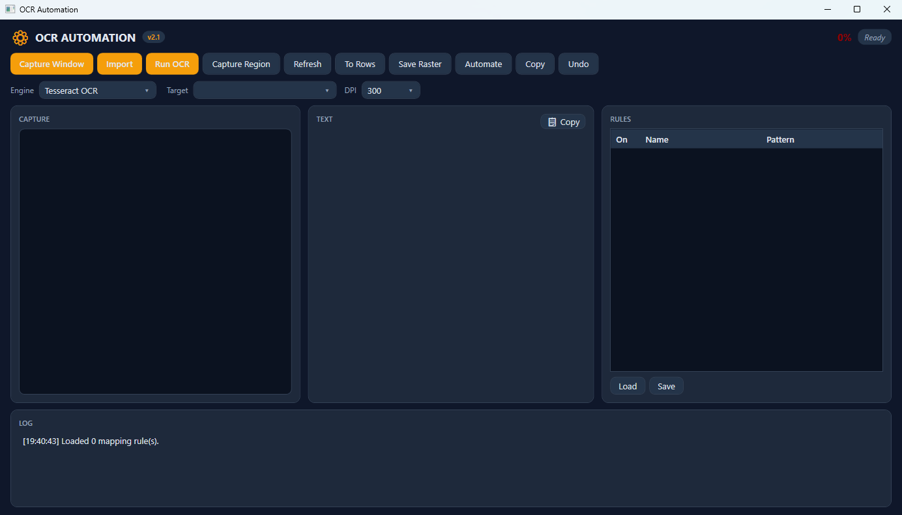

# OCR Automation Tool v2.2.0

> Offline Windows OCR automation — capture, read, and rasterize anything on screen.
> **[⬇ Download v2.2.0 for Windows](https://github.com/DarthSandD/ocr-automation/releases/latest)** (portable ZIP, no install, no admin)



A Windows 10/11 desktop utility for capturing a window or screen region, extracting text with OCR, arranging it into rows, saving raster images, and running explicitly triggered mapping actions. It does not monitor in the background or install global hooks.

## Quick start (no SDK needed)

1. Launch `publish-loose/OcrAutomation.exe` (self-contained, official build).
2. Click **Refresh Windows**, pick a target (or skip — Capture auto-picks the first usable window).
3. Click **Capture Window**, **Capture Region**, or **Import** (PDF renders at 150/300/600 DPI with page navigation — detail fit for AutoCAD/MicroStation raster attach).
4. Click **Run OCR** — the better of raw/preprocessed results wins (logged), with confidence shown.
5. Click **To Rows** to clean the text into notepad rows, **Save Raster** to save the capture as PNG, or **Copy to Clipboard**.
6. Click **Run Automation** to execute matching rules from `sample_mappings.json`.

Tesseract English data is bundled and extracted beside the executable on first start. Only Tesseract is used — the Windows Media OCR entry is a non-functional stub and is never selected.

## Automation key tokens

Keystroke and SetText values may contain ordinary Unicode text and tokens such as `{ENTER}`, `{TAB}`, `{ESC}`, `{BACKSPACE}`, `{DELETE}`, `{LEFT}`, `{RIGHT}`, `{UP}`, `{DOWN}`, `{HOME}`, `{END}`, `{PAGEUP}`, `{PAGEDOWN}`, `{F1}`–`{F12}`, or combinations such as `{CTRL+Z}`. Invalid tokens are rejected instead of silently sending partial input.

Automation is only started by pressing **Run Automation**. Elevated target processes are blocked by Windows UIPI unless this application is also elevated. Mouse clicks cannot be automatically undone; keyboard/text undo sends Ctrl+Z to the focused target.

## Mapping files

Use **Load Rules** and **Save Rules** to manage JSON rules. Saving creates missing parent directories. Keep writable rules outside a protected install directory when running from `Program Files`.

```json
{
  "rules": [
    { "name": "Click OK", "enabled": true, "pattern": "OK", "actions": [{ "type": "Keystroke", "value": "{ENTER}" }] }
  ]
}
```

## Limitations

Protected/secure desktop content, minimized windows, GPU surfaces, and some elevated applications cannot be captured by ordinary Win32 APIs. DPI scaling and multi-monitor capture are supported on a best-effort basis. If capture is black or empty, restore the target window and retry with a visible non-elevated window.

## Development

```powershell
dotnet restore OcrAutomation.sln
dotnet build OcrAutomation.sln -c Release
dotnet test OcrAutomation.sln -c Release
dotnet publish src/OcrAutomation/OcrAutomation.csproj -c Release -r win-x64 --self-contained true -o publish-loose
```

> Do NOT publish with `-p:PublishSingleFile=true`. Tesseract 5.2.0's native loader resolves libraries via `Assembly.Location`, which is empty in single-file bundles, so the OCR engine never starts. `publish-loose/` is the official build (verified: 90% OCR vs engine-dead single-file).

The published executable should be tested from the output directory, not only from the source tree. UIA smoke scripts live in `tools/` (`uia_refresh.ps1`, `uia_capture_ocr.ps1`, `uia_log.ps1`, `uia_rows_raster.ps1`).


Portable Windows OCR automation tool to capture text from any window/region and automate actions.

## Prerequisites
- Windows 10/11
- .NET 8 SDK
- Tesseract language data in `assets/tessdata/` (e.g., `eng.traineddata`)

## Administrator Note
To automate elevated windows (Task Manager, Device Manager, etc.), this app must be run as Administrator.

## Build
```bash
cd project-ai/OcrAutomation
dotnet build src/OcrAutomation/OcrAutomation.csproj -c Release
```

## Run
```bash
dotnet run -c Release --project src/OcrAutomation/OcrAutomation.csproj
```

## Usage
1. Click **Refresh Windows** to list visible windows.
2. Select a target window OR click **Capture Region** to drag-select an area.
3. Click **Run OCR** — recognized text appears and is automatically copied to the clipboard.
4. Click **Copy to Clipboard** to manually copy.
5. Click **Run Automation** to execute mapped actions (requires `sample_mappings.json`).

## OCR Engines
- **Tesseract** (default, bundled `tessdata`)
- **Windows.Media.Ocr** (Windows 10+ built-in)

If a confidence warning appears, review the recognized text before running automation.

## Mapping Rules (sample_mappings.json)
Place in the application output directory:
```json
{
  "rules": [
    { "name": "Click OK", "enabled": true, "pattern": "OK", "actionType": "Click" },
    { "name": "Type username", "enabled": true, "pattern": "Username:", "actionType": "SetText", "actionValue": "admin" },
    { "name": "Press Enter", "enabled": true, "pattern": "Submit", "actionType": "Keystroke", "actionValue": "Enter" }
  ]
}
```

## Tests
```bash
dotnet test tests/OcrAutomation.Tests/OcrAutomation.Tests.csproj
```

## Troubleshooting
- **OCR returns no text**: ensure the target window is visible and not minimized. v2 runs OCR on raw + preprocessed and keeps the winner — an empty result now logs hints.
- **Capture is black**: the window may be running at a different DPI. Use Region capture.
- **Automation blocked**: the target window is elevated. Run this app as Administrator.
- **"No OCR engine"**: the old single-file `publish/` build cannot start Tesseract — use `publish-loose/OcrAutomation.exe`. The log now prints the init error detail.
